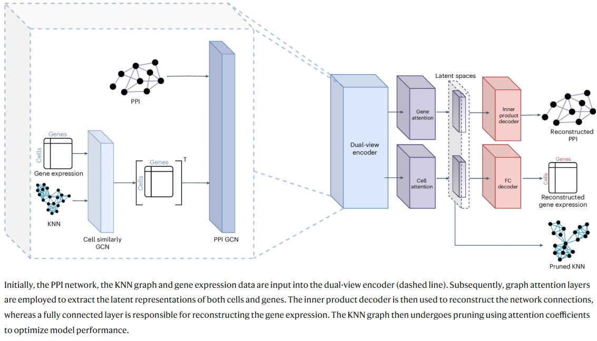

# scNET:  learning context-specific gene and cell embeddings by integrating single-cell gene expression data with protein–protein interactions

- Intro：scRNA-seq gene expression level usually cannot capture changes in pathways and complexes. The data also often have noise and 0 inflation. This paper integrated scRNA-seq dataset and PPI, based on GNN, models gene-to-gene relationships using an attention mechanism. The method better captures gene annotations, pathway characterization and gene-gene relationship.

## Model and methods

Overview: a method combines both gene-gene and cell-cell relations to learn condition specific gene and cell embeddings together. It also refine cell-cell relation graph by an edge attention-based mechanism. Achieving better downstream biological performance.

### Data prepossessing

log norm -> high variance gene filtering -> dimensionality reduction (UMAP) -> KNN graph construction -> scaling gene expression to mean of 0 and s.d. of 1

human PPI with >0.5 score was used, and removed genes with no expression in sc data.

### Encoder

Alternately applying a convolution layer to aggregate information between similar cells, imputing missing values and reducting noise level. Applying another convolution layer on PPI. Then passed through a graph attention layer to produce the latent representation.

- graph convolution layer

Define graph $G=(V,E)$ with $N=|V|$ nodes and adjacent matrix $A \in R^{N \times N}$.

Node feature matrix $X \in R^{N \times F}$.

Output of a single convolution layer $\sigma (\hat{A}\delta{X}W)$, $\sigma$ is the activation function. $\delta$ is droupout.

Set weight for edge weight, to balance degree different of nodes: $\hat{A}=D^{-\frac{1}{2}} \overline{A} D^{-\frac{1}{2}}$. $D$ is the diagonal degree matrix.(* weight of edge between node i and j change to $\frac{1}{\sqrt{d_{i}d_{j}}}$)

Add self-ring $\overline{A}=A+I$

- graph attention layer

Refine cell-cell similarity graph by learing a weight for edge (because this graph originally doesn't exists edge weight).
For an input feature matrix $X \in R^{N \times F}$, attention layer aggregates information from all nodes to score a given node. For node $i$ with degree $d$, 

$\mathbf{x_{i}'}=\mathbf{W_{1}x_i} + \sum_{j \in{N(i)}} \mathbf{\alpha_{i,j}W_2x_j}$,

where $N(i)$ are the neighbors of node $i$ in the network and attention coefficient is

$\alpha_{i,j}=sigmoid(\frac{\mathbf{(W_3x_i)}^T \cdot \mathbf{(W_4x_j)}}{\sqrt{d}})$

$W_1,W_2,W_3,W_4$ are learnable matrices. GAT originally use softmax to make the sum of all attention paras as 1, which may introduce unnecessary weight for noise neighbor, here the author use sigmoid to reduce this problem.

- KNN graph purning

KNN graph assumes that one cell has K fixed neighbors. Here, authors purned knn edges by attention weight.

$E'=\{(i,j) | (i,j) \in E \enspace \text{and} \enspace \alpha_{i,j} > \beta\}$,

$P_{10}$ is the 10th percentile and $\beta$ is defined as $max(0,P_{10})$

