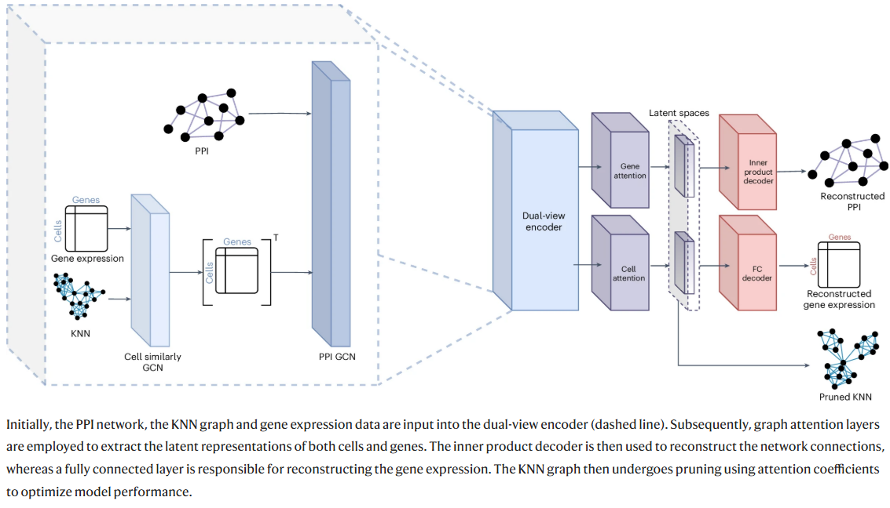
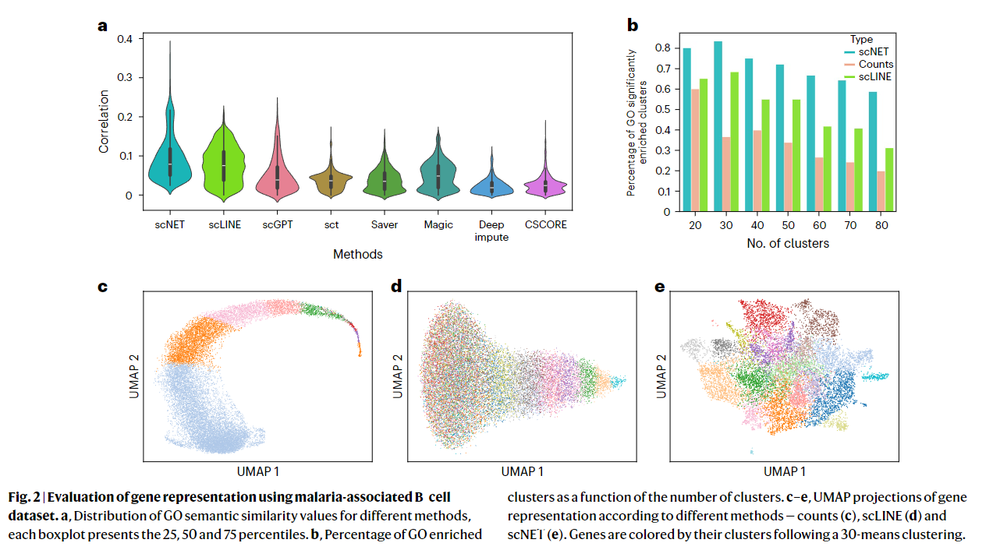
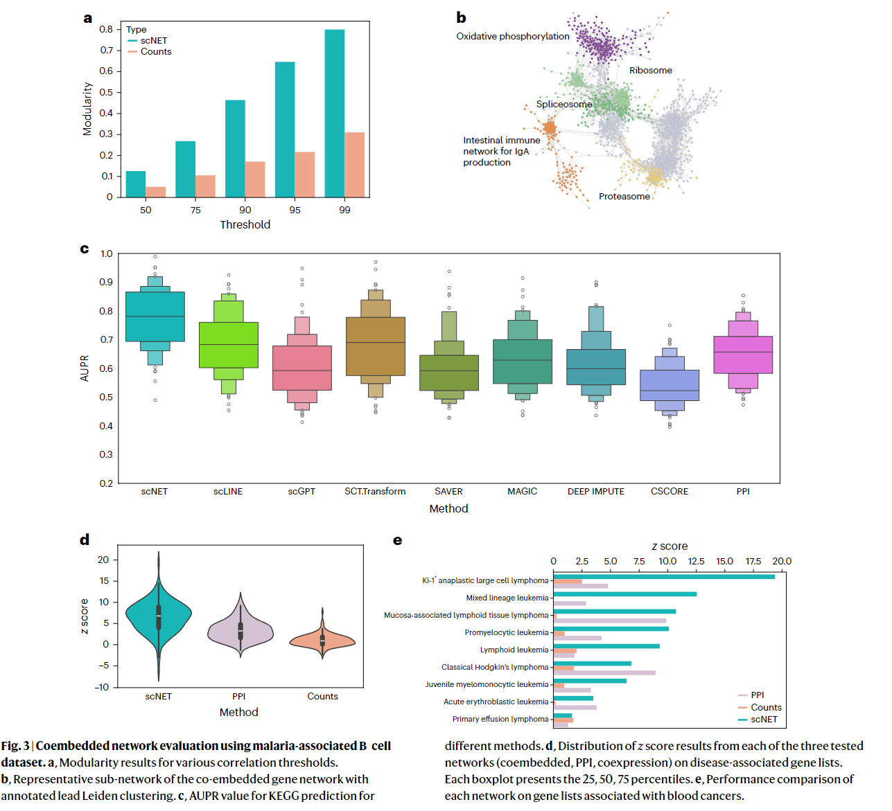
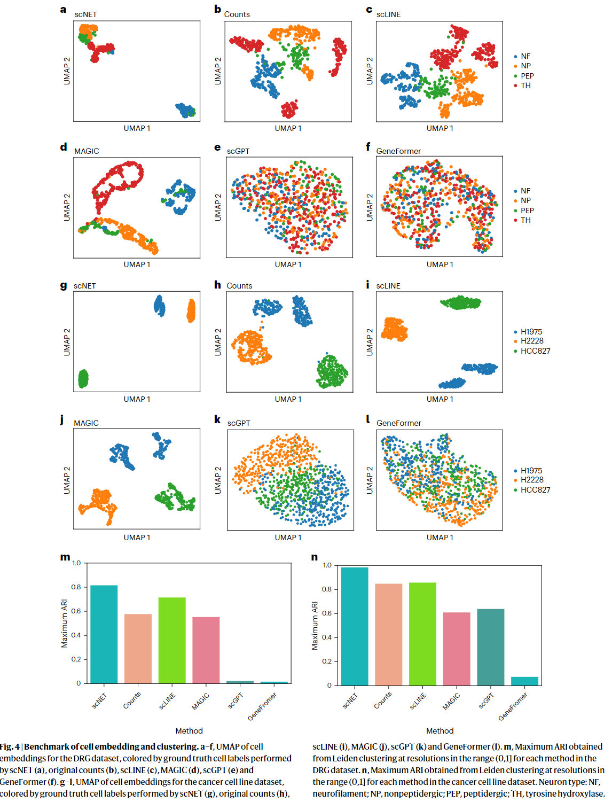
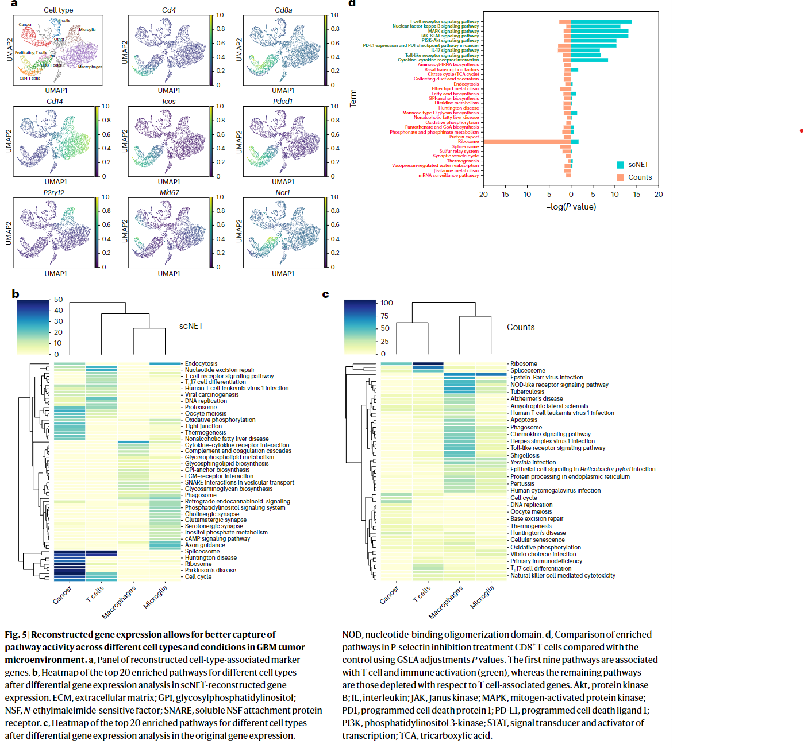

# scNET:  learning context-specific gene and cell embeddings by integrating single-cell gene expression data with protein–protein interactions

- Intro：scRNA-seq gene expression level usually cannot capture changes in pathways and complexes. The data also often have noise and 0 inflation. This paper integrated scRNA-seq dataset and PPI, based on GNN, models gene-to-gene relationships using an attention mechanism. The method better captures gene annotations, pathway characterization and gene-gene relationship.

## Model and methods

Overview: a method combines both gene-gene and cell-cell relations to learn condition specific gene and cell embeddings together. It also refine cell-cell relation graph by an edge attention-based mechanism. Achieving better downstream biological performance.

### Data prepossessing

log norm -> high variance gene filtering -> dimensionality reduction (UMAP) -> KNN graph construction -> scaling gene expression to mean of 0 and s.d. of 1

human PPI with >0.5 score was used, and removed genes with no expression in sc data.

### Encoder

Alternately applying a convolution layer to aggregate information between similar cells, imputing missing values and reducting noise level. Applying another convolution layer on PPI. Then passed through a graph attention layer to produce the latent representation.

- graph convolution layer

Define graph $G=(V,E)$ with $N=|V|$ nodes and adjacent matrix $A \in R^{N \times N}$.

Node feature matrix $X \in R^{N \times F}$.

Output of a single convolution layer $\sigma (\hat{A}\delta{X}W)$, $\sigma$ is the activation function. $\delta$ is droupout.

Set weight for edge weight, to balance degree different of nodes: $\hat{A}=D^{-\frac{1}{2}} \overline{A} D^{-\frac{1}{2}}$. $D$ is the diagonal degree matrix.(* weight of edge between node i and j change to $\frac{1}{\sqrt{d_{i}d_{j}}}$)

Add self-ring $\overline{A}=A+I$

- graph attention layer

Refine cell-cell similarity graph by learing a weight for edge (because this graph originally doesn't exists edge weight).
For an input feature matrix $X \in R^{N \times F}$, attention layer aggregates information from all nodes to score a given node. For node $i$ with degree $d$, 

$\mathbf{x_{i}'}=\mathbf{W_{1}x_i} + \sum_{j \in{N(i)}} \mathbf{\alpha_{i,j}W_2x_j}$,

where $N(i)$ are the neighbors of node $i$ in the network and attention coefficient is

$\alpha_{i,j}=sigmoid(\frac{\mathbf{(W_3x_i)}^T \cdot \mathbf{(W_4x_j)}}{\sqrt{d}})$

$W_1,W_2,W_3,W_4$ are learnable matrices. GAT originally use softmax to make the sum of all attention paras as 1, which may introduce unnecessary weight for noise neighbor, here the author use sigmoid to reduce this problem.

- KNN graph purning

KNN graph assumes that one cell has K fixed neighbors. Here, authors purned knn edges by attention weight.

$E'=\{(i,j) | (i,j) \in E \enspace \text{and} \enspace \alpha_{i,j} > \beta\}$,

$P_{10}$ is the 10th percentile and $\beta$ is defined as $max(0,P_{10})$

So that, the model learned a new topology of KNN network.

### Decoder and loss function

The inner product decoder is defined as $\hat{A}=\sigma(ZZ^T)$, $Z$ is the latent representation of the genes and $\sigma$ is the sigmoid activation function.

($Z \in \mathbb{R}^{N\times d}$, $N$ is the num of genes, $d$ is embedding's dimention, $ZZ^T$ is the similarity of gene-gene pairs)

$Z_{pos}$ is the gene-gene pairs with PPI, $Z_{neg}$ is randomly sampled negative edges, with the same size of pos.

Loss function of PPI:

$L_{PPI} = - \sum_{z \in Z_{pos}} log(z) - \sum_{z'\in Z_{neg}} log(1-z')$,
when pos samples close to 1, the loss close to 0; when pos samples close to 0, loss becomes larger. Opposite way for neg samples.

Then highly viriable gene level's loss function is introduced, and is defined as:

$L_v = MSE(M_v, \hat{M_v})$.

This ensure that the model reconstructs highly viriable genes' expression pattern first.

Final loss function is:
$L = \lambda_{PPI} L_{PPI} + \lambda_{V} L_V$, $\lambda_{PPI}$ and $\lambda_{V}$ are hyper-parameters of the model.

### Network evaluation

Use random walk with restart approach to evaluate the relationship of network. Known gene group(KEGG pathway, etc.) was divided into training and test sets, applied random walk with restart to propagate membership from the training group to all other nodes. The propagation score were used as membership scores to calculate AUC scores for each network. Given adjacency matrix $W$ and node degree matrix $D$, the propatation is computed by:

$\mathbf{F^{t+1}} = \alpha W'\mathbf{F^t} + (1-\alpha)\mathbf{F^0}$,

$W' = D^{-1/2}WD^{-1/2}$ is the normalized adjacency matrix.

$\mathbf{F^0}$ represents the input gene vector, with training set genes as 1 and test set as 0.

$\alpha$ is the restart proportion to balance propagation and input.

Propagation score $\mathbf{F^\infty}$ represents the likelihood of each gene are involved in the input gene group.

Eliminate degree influence: $\mathbf{F^\infty}$ divide $\mathbf{F^\infty}$ of all group genes as 1 in input vector.

Calculating AUC of given gene group to evaluate the prediction ability.

Significance evaluation: for each network, generate 30 degree-preserving random networks to establish background. An AUC score was calculated for each network and transformed into a z score using the distribution of scores on the randomized networks.

## Results

### scNET gene embedding better captures functional annotation

Whether the correlations in the embedding space accurately reflected known biological annotations and functions. Authors calculated the GO semantic similarity and the coembedded coefficient for every gene pair. Comparing with other method, scNET showed better correlations(Figure 2a).

To measure the ability of clustering genes, using k-means with cluster numbers ranging from 20 to 80, measured the percentage of clusters significantly enriched for one or more GO terms. Enrichment was calculated by GSEA(Figure 2b), and UMAP also showed better clustering compared with other methods when k=30(Figure 2c-e).

### scNET coembedded network captures biological pathways

Then authors use learned gene representation to construct a coembedded network, integrating PPI and gene expression information. By comparing Leiden Modularity of embedding and input counts, scNET showed more modular than original space counterparts across all resolutions(Figure 3a-b).

To further evaluate the resulting network, they use the method stated in method section, each KEGG pathways was separated into training and test set, and calculate the propagation score. scNET outperforming previous approaches(Figure 3c).

They also used a disease-related gene list, scNET achieved better z score (Figure 3d). In leukemia and lymphomas subtype gene lists, scNET performed better than both other networks in 6/9 lists (Figure 3e). (By comparing with origin PPI and counts network)

### Evaluating of clustering

Evaluate the ability of scNET to refine cell-cell similarity, and employed Leiden clustering, comparing maximum adjusted rand index (ARI). scNET achieved highest ARI in known cell label scseq dataset (Figure 4).

### scNET reduces zero inflation and improves pathway analysis

Applying scNET to mouse brain tumor model dataset. visualized the reconstructed cell clustered according to their cell types (Figure 5a). Besides, scNET achieved best AUPR of marker gene expression for identifying different cell types (Table 1), comparing with counts or imputation method.

By using standard DEG analysis, enriched KEGG pathway of each cluster was obtained. scNET-reconstructed data captured relevant pathways associated with each population(Figure 5b-c).

## Conclusion and discussion

This study introduced a deep learning framework, integrates scRNA-seq data with PPI networks. The model incorporates two graphs and a node feature matrix. One network captures relationships dipicted by rows(genes), the other outlines relationships demostrated by columns (cells). The study also introduced a meticulous validation framework.

This study incorporates PPI network into scRNA-seq data analysis, by passing information between cell-cell graph and PPI graph, information has been introduced into gene embedding, evaluated performance of downstream analysis, like clustering, data imputation, etc.

However, this method make simple gene counts in scRNA-seq data into more complicated gene representation. If the output gene matrix represents true expression level and if it can be used in comparing gene expression directly still need to be discussed.